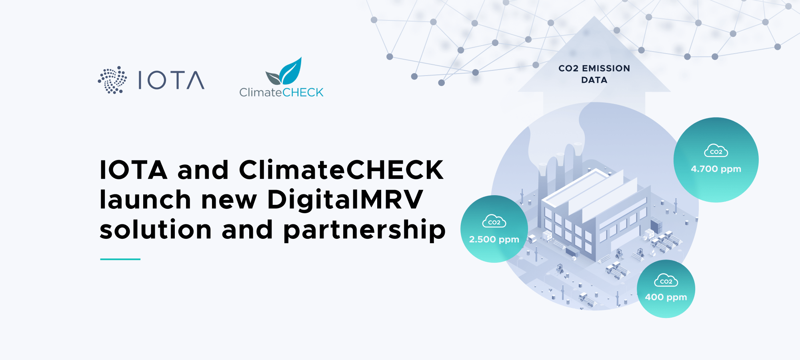

<!--
---article_info
title: Was ist ein Colored Coin?
author: [Schmucklos]
reviews: [reviewer_1, reviewer_2]
---
-->
# ❌ ClimateCHECK

> IOTA und ClimateCHECK starten neue DigitalMRV-Lösung und strategische Partnerschaft

Bei IOTA glauben wir an die positiven Auswirkungen der IoT-Technologien auf unser Wirtschaftssystem und unser tägliches Leben. Es ist jedoch oft schwer zu sagen, inwiefern diese Technologien heute einen Mehrwert bieten, indem sie zur Lösung von Herausforderungen beitragen, die wir hier und jetzt haben. Nach fast zwei Jahren der Zusammenarbeit freuen sich die IOTA Foundation und ClimateCHECK, ein führender internationaler Anbieter von Klima- und Cleantech-Diensten und -Lösungen, über die Ankündigung einer strategischen Partnerschaft zur Erweiterung unserer Zusammenarbeit, um innovative Technologien für den Klimawandel, saubere Technologien und Nachhaltigkeit zu schaffen, die ein offenes Ökosystem rund um nachhaltige DLT-Protokolle fördern. Wir freuen uns auch über die ersten Ergebnisse unseres gemeinsamen Bestrebens, die DigitalMRVTM -Lösung zu schaffen, die einen Prozess rationalisiert und digitalisiert, der als Measurement, Reporting and Verification, kurz MRV, bekannt ist.

Die IOTA Foundation und ClimateCHECK haben im Rahmen verschiedener Initiativen wie der Climate Chain Coalition oder INATBA zusammengearbeitet, basierend auf ihrer gemeinsamen Vision, den Zugang zu Klimatechnologien zu demokratisieren und Multi-Stakeholder-Ökosysteme auf der Grundlage offener und transparenter Prozesse für die Umweltgesamtrechnung aufzubauen. Als eine wichtige Maßnahme zur Mobilisierung der Weltgemeinschaft im Kampf gegen den Klimawandel sind CO2-Gutschriften und -zertifizierung eines der wichtigsten Marktinstrumente, um Anreize für Investitionen in saubere, nachhaltige Aktivitäten zu schaffen. Heutzutage erfordert die Notwendigkeit einer hohen Sicherheit in diesem System kostspielige und zeitaufwändige Zertifizierungsprozesse. Besonders in Entwicklungsländern schränkt dieser Zertifizierungsprozess aufgrund der unerschwinglichen Kosten oft die positiven Anreize ein, CO2-Reduktionen als tatsächliche CO2-Gutschriften zu qualifizieren.

Tom Baumann, CEO von ClimateCHECK, kommentierte die Initiative: "Wir arbeiten seit 1998 in verschiedenen Rollen an Fragen des Klimawandels und seit 2009 mit einem Schwerpunkt auf der Integration digitaler Lösungen in Mess-, Berichts- und Verifizierungssysteme (MRV). Digitale Innovationen schreiten rasch voran und werden immer wichtiger für die effiziente und effektive Skalierung von Klimamaßnahmen und national festgelegten Beiträgen im Rahmen des Pariser Abkommens, Klimafreundliche Technologien, CO2-Märkte, Anpassungen der CO2-Grenzen, die Offenlegung des Klimas und die Finanzierung - um nur einige Beispiele zu nennen. Wir freuen uns darauf, unsere strategische Partnerschaft mit IOTA und ihren robusten digitalen Ökosystemen zu erweitern, um mit DigitalMRVTM den Standard für die Next Generation Versicherung zu setzen, um innovative Lösungen für Klimawandel, Cleantech und Nachhaltigkeit zu ermöglichen".

Wir begannen unsere Zusammenarbeit mit einem 14-monatigen gemeinsamen Pilotprojekt zum Einsatz von DigitalMRV an einer Deponiegasauffang- und -verwertungsanlage in Chile, das von der kanadischen Regierung über Environment and Climate Change Canada (ECCC) als Teil des Reciclos Organicos-Projekts finanziert wird. IOTA arbeitet gemeinsam mit den MRV-Experten von ClimateCHECK sowie mit Arcadis, ENC Energy, ImplementaSur und der chilenischen Regierung daran, zu zeigen, wie die Digitalisierung von MRV-Aktivitäten durch die Integration des IOTA-Protokolls auf Gateway-Geräten die Kosten von MRV drastisch senken und die nachgelagerte Nutzung der Zertifizierung von CO2-Gutschriften verbessern kann, indem eine einzige Version der Wahrheit in den Sensormesswerten in Echtzeit eingeführt wird. Wir glauben, dass dies ein riesiger Schritt zum Nachweis der Machbarkeit von Distributed Ledgers und, was noch wichtiger ist, von Protokollen ohne Erlaubnis für den Klimaschutz und die nachhaltige Transformation unserer Wirtschaftssysteme ist. Durch diesen Prozess aktualisieren wir die Kernanforderungen zur Schaffung eines vertrauenswürdigen digitalen Zwillings der Deponiegasanlage (LFG) durch unveränderliche, nahezu in Echtzeit erfolgende Datenströme von einer Reihe von Sensoren vor Ort.

Franck Portalupi von Environment and Climate Change Canada kommentierte das Pilotprojekt: "Kanada ist stolz darauf, das Pilotprojekt in Chile zu unterstützen, das modernste Methoden zur Verfolgung von Emissionsreduzierungen in Echtzeit demonstriert. Dies ist ein hervorragendes Beispiel dafür, wie die kanadische Klimafinanzierung den Ländern hilft, ihre Klimaverpflichtungen im Rahmen des Pariser Abkommens zu erfüllen.''

## IOTA - Ein nachhaltiges Ledger (Hauptkassenbuch)

Letztlich betreffen die ökologischen Herausforderungen uns alle. Wir bei der IOTA Foundation glauben grundsätzlich daran, dass dies nicht nur Herausforderungen, sondern auch Chancen mit sich bringt. Mit unserer Technologie, die in den Kern von Digital MRV integriert ist, wollen wir diese Möglichkeiten so vielen Menschen wie möglich zugänglich machen. Im Gegensatz zu genehmigungspflichtigen Ökosystemen nutzt die Digital MRV-Lösung die genehmigungsfreie Architektur von IOTA und wahrt gleichzeitig die Privatsphäre sensibler industrieller Prozesse durch IOTA-Streams. Herkömmliche zentralisierte Datenstromlösungen weisen eine Vielzahl von prozessimmanenten Single Points of Failure auf und sind offen für zahlreiche Möglichkeiten der Datenmanipulation entlang des Datenpfades und der Datenleitung. Durch die Nutzung manipulationssicherer Funktionen können die Datenströme jedoch vom Zeitpunkt der Datenerstellung an gesichert und über ein vertrauenswürdiges, genehmigungsloses und gebührenfreies Netzwerk gesendet werden. Dies ermöglicht einen granularen Grad an nahezu Echtzeit-Verantwortlichkeit und Transparenz in Bezug auf das, was die Einrichtung tut, was direkt der Erstellung und Verifizierung von Emissionsgutschriften zugute kommt. Das Design stellt auch sicher, dass keine neuen Schwachstellen in die bestehenden SCADA-Systeme (Supervisory Control and Data Acquisition) eingebracht werden.

Die Verwendung von manipulationssicheren Daten wird durch die Integration der IOTA-Streams und des IOTA-Tangle ermöglicht. Mit IOTA Streams werden die Daten in leicht verwertbaren Datenstrukturen formatiert, wo die Daten in der Anlage erzeugt werden. Sie werden dann durch kryptographische Integrationen gesichert, die in die Streams-Funktionalität integriert sind und als Datenübertragungsmechanismus über das IOTA Tangle geschickt werden. Die Verwendung des IOTA Tangle als Übertragungsmechanismus ermöglicht einen nahezu Echtzeit-Zugriff auf die Daten aus der Anlage, eine manipulationssichere historische Aufzeichnung der erzeugten Daten, einen skalierbaren Kern, der für jede andere Art von Klimadaten erweitert werden kann, und eine interoperable Infrastruktur, die keine Grundgebühren für die Nutzung oder Weitergabe dieser Daten erfordert.

Für die künftige Arbeit kann die Aktualisierung vertrauenswürdiger CO2-Gutschriften durch die Verwendung von tokenisierten Frameworks für digitale Vermögenswerte ermöglicht werden, die derzeit in die Kernfunktionalität des IOTA-Protokolls integriert werden. Dies wird einen ganzheitlichen Ansatz für die Schaffung verifizierbarer CO2-Gutschriften und die Schaffung von Anreizen für ein nachhaltiges Wirtschaftswachstum schaffen, indem diese CO2-Gutschriften direkt mit den Auswirkungen in Beziehung gesetzt werden, die diejenigen, die die CO2-Gutschriften erwerben, auf die Umwelt haben. In seinem derzeitigen Stadium ermöglicht das Pilotprojekt eine gründliche Erprobung der inhärenten Sicherheit für neue digitale Zwillingsprozesse, auf die man aufbauen kann, und ermöglicht die Schaffung einer einzigen Quelle der Wahrheit für Umweltdaten vom Rand des Netzwerks (Endgeräte) aus. Es räumt auch Bedenken hinsichtlich des Datenschutzes aus, da es keine zentrale Hosting-Behörde gibt, was den doppelten Vorteil hat, dass das traditionelle Problem der Herstellerbindung entfällt. Der Kern des IOTA-Protokolls ist quelloffen, erlaubnisfrei, gebührenfrei und skalierbar. Diese Lösung kann also in der gesamten Deponiegasindustrie weiter wachsen, um neue Standards und Ebenen der Zusammenarbeit zu etablieren, die in der Vergangenheit aufgrund von Eigentums- und Verantwortlichkeitsstreitigkeiten schwierig zu erreichen waren.

Dominik Schiener, Mitbegründer der IOTA Foundation: "Seit wir die IOTA Foundation gegründet haben, haben wir uns darauf konzentriert, nicht nur ein freies Protokoll zu schaffen, sondern auch unsere Technologie zu nutzen, um zur Bewältigung der großen menschlichen Herausforderungen des 21. Jahrhunderts beizutragen. Wir sind sehr stolz darauf, dass wir zusammen mit unserem Partner ClimateCHECK und mit Unterstützung des kanadischen Ministeriums für Umwelt und Klimawandel (ECCC) die Machbarkeit von IOTA unter Beweis stellen konnten, indem wir zu mehr Vertrauen und geringeren Kosten im Bereich des Klimawandels beigetragen und Ressourcen frei gemacht haben, um direkt zum Klimaschutz beizutragen. Die Lösung bietet nicht nur Einblicke in die Überwachung von Treibhausgasemissionen der nächsten Generation, sondern hebt auch das Alleinstellungsmerkmal des IOTA-Protokolls und seine Fähigkeiten für das Internet der Dinge hervor. Unsere Zusammenarbeit mit ClimateCHECK hat uns in die Lage versetzt, unsere jahrelange Erfahrung im Bereich der Klimastandards und -sicherheit mit unserer Führungsposition bei der Kombination von IoT- und DLT-Technologie zu kombinieren, um das Potenzial des IOTA-Protokolls als nachhaltiges Protokoll aufzuzeigen.

Wir hoffen, zusätzliche Innovationen im Spektrum des DigitalMRV anzuregen und unsere Arbeit auf weitere industrielle Anwendungsfälle in anderen Umweltsektoren auszudehnen sowie kleinere, gemeinschaftsgetriebene Projekte aus unserem Ökosystem in zukünftige Integrationen einzubeziehen. Darüber hinaus ist der Wert der Digitalisierung von MRV am größten, wenn man die gebührenfrei Wertübertragung mit manipulationssicheren Datenübertragungsfähigkeiten in einem einzigen Protokoll kombiniert, was eine weltweite Vereinheitlichung der Standards für Tokenized Carbon Credits ermöglicht. Und schließlich ermöglicht es uns der geringe Ressourcenbedarf von IOTA, das Vertrauen in Umweltdaten so nah wie möglich an den Randbereich des Netzwerks zu bringen. Gleichzeitig stellen wir sicher, dass dieses Vertrauen mit Hilfe einer Distributed-Ledger-Technologie wachsen kann, die aufgrund ihres kooperativen Konsensmodells und ihres energieeffizienten Designs auch einen niedrigen CO2-Fußabdruck hat.

## Wie geht es weiter?

Dieses Pilotprojekt ist nur ein weiterer Schritt auf der Suche von IOTA nach einem nachhaltigen Internet der Dinge und dem Aufbau skalierbarer Nachhaltigkeitslösungen mit unseren Partnern. Während wir planen, das Projekt in den nächsten sechs Monaten auf weitere Anlagen und verschiedene Industriezweige auszudehnen, planen wir auch, den Umfang und die Fähigkeiten des Projekts in Zukunft gemeinsam mit ClimateCHECK und unserem breiteren Ökosystem zu erweitern. Bleiben Sie auf dem Laufenden für weitere Ankündigungen in den kommenden Monaten oder wenden Sie sich an uns, wenn Sie sich unserer Mission anschließen möchten, Open-Source-Technologien zu entwickeln, die die Herausforderungen des 21. Jahrhunderts lösen.

> Übersetzung des Blogartikel von den Autoren Florian Doebler & Mathew Yarger, IOTA Foundation.

